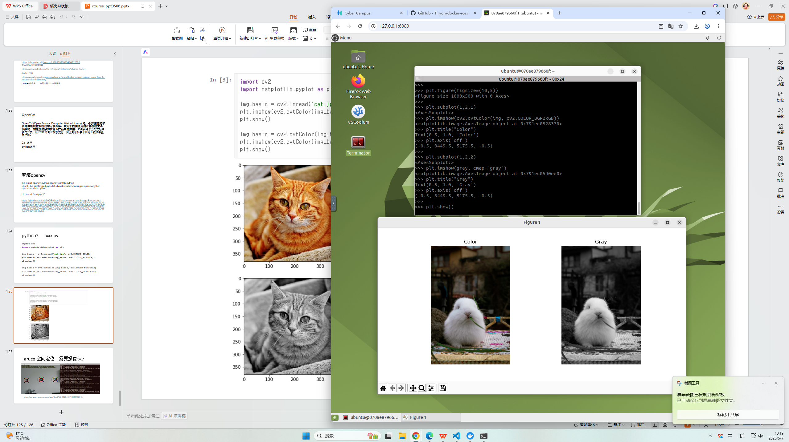

本周主要围绕 Docker 容器化技术与 OpenCV 计算机视觉基础展开学习与实践，具体内容如下：

一、Docker 概念与基础使用

本部分主要帮助理解“容器化”思想，并掌握 Docker 的基本操作流程。

首先学习了 Docker 的核心概念，包括镜像（Image）、容器（Container）以及仓库（Repository），并理解了其在软件部署与环境管理中的作用。同时，对比了容器与虚拟机的区别，认识到 Docker 在资源占用与部署效率方面的轻量化优势。

在实践方面，学习了 Docker 的基本工作流程：拉取镜像 → 创建容器 → 运行应用 → 管理容器，并掌握了常用命令，包括：

docker pull：拉取镜像
docker run：运行容器
docker ps：查看运行中的容器
docker stop / rm：停止与删除容器

通过实际操作，初步体验了使用 Docker 快速部署开发环境的过程，加深了对容器化技术的理解。

二、OpenCV 介绍与安装实验

本部分主要学习计算机视觉基础工具 OpenCV 的基本概念与使用方法。

首先了解了 OpenCV 的基本作用，它是一个开源的计算机视觉库，广泛用于图像处理与视觉识别任务。学习了其常见应用场景，包括图像读取与显示、图像预处理（如灰度化、滤波）以及简单的视频捕获与处理等。

同时，了解了 OpenCV 常用的开发环境（Python 与 C++），并完成了 OpenCV 的安装实验：

使用 pip 完成 OpenCV 安装
验证安装是否成功（如读取并显示图像）
运行基础示例代码，体验图像处理的基本流程

通过实践，对计算机视觉开发流程有了初步认识。

三、本周整体收获

本周通过理论学习与实践操作相结合的方式，初步掌握了 Docker 的容器化思想与基本使用方法，并成功搭建 OpenCV 开发环境，完成了从环境配置到简单图像处理的完整实践流程。

通过本次学习，不仅提升了对开发环境管理的理解，也为后续机器学习与计算机视觉相关课程的学习奠定了基础。
