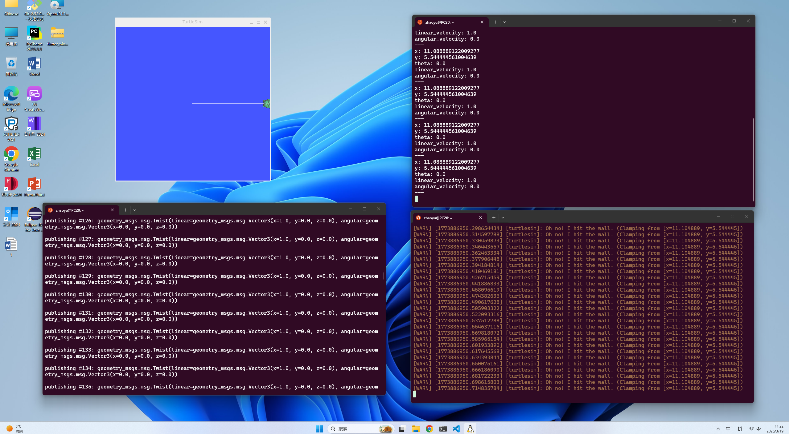

第三周学习总结：跨平台开发环境集成与 ROS 通信机制实践
本周的学习与实践主要围绕 Linux 高效开发环境配置、远程分布式代码管理以及机器人操作系统（ROS）的基础架构展开。通过理论结合实际操作，成功打通了“本地编码-远程同步-仿真验证”的完整机器人开发工作流。具体内容总结如下：

一、 GitHub SSH 密钥配置与基于终端的代码版本管理
在软件工程和分布式开发中，代码版本控制与安全传输是研发的基石。本周我在 Ubuntu 环境下深入学习了安全外壳协议（SSH）的核心原理。通过执行 ssh-keygen -t rsa -b 4096 命令，利用非对称加密算法在本地生成了包含身份验证信息的公钥（id_rsa.pub）与私钥（id_rsa）。在将公钥成功托管至 GitHub 账户后，通过 ssh -T git@github.com 命令完成了连接测试，实现了本地 Linux 终端与远程代码仓库之间的高安全、免密码双向认证。
在此基础上，我进一步熟练掌握了 Git 核心工作流的命令行交互。通过 git clone 克隆远程仓库，利用 git pull 同步团队代码，以及通过 git add、git commit 和 git push 将本地修改推送到云端。这不仅规避了频繁输入密码的繁琐操作，还初步建立了规范的代码版本控制意识，为后续多团队协同开发机器人项目奠定了基础。

二、 VS Code 与 WSL Ubuntu 环境的深度集成
为了构建兼顾 Windows 日常办公便捷性与 Linux 原生开发高性能的编程环境，本周我完成了 Visual Studio Code (VS Code) 与 Windows Linux 子系统 (WSL) 的深度集成。通过在 VS Code 中安装 Remote - WSL 核心插件，实现了跨越操作系统边界的远程开发工作流。
在这种架构下，VS Code 作为轻量级的前端编辑器运行在 Windows 侧，而底层的代码解析、编译、调试以及 Python/C++ 运行环境则完全依托于 WSL Ubuntu 子系统。我学会了如何在 Windows 终端中通过 code . 命令直接唤醒 VS Code 并挂载 Linux 目录，并在集成终端中直接调用 Linux Shell。这种配置极大地减少了传统虚拟机（如 VMware）带来的系统资源暴涨与硬件隔阂，大幅提升了跨平台开发的编译效率与一致性。

三、 ROS 小乌龟节点运行与发布/订阅通信机制解构
本周最核心的实践是运行了机器人操作系统（ROS）的经典“小乌龟”仿真程序（turtlesim），并以此为切入点剖析了 ROS 的分布式通信架构。
首先，我通过启动 ROS Master（roscore）建立了系统中央节点管理器，随后分别启动了图形化仿真节点（turtlesim_node）和键盘控制节点（turtle_teleop_key）。在实验过程中，我深入研究了 ROS 的发布/订阅（Publish/Subscribe）异步通信模式：键盘控制节点作为发布者（Publisher），将用户的按键转换为速度控制指令，向特定的话题（Topic，如 /turtle1/cmd_vel）发布消息（Message）；而小乌龟仿真节点作为订阅者（Subscriber），实时监听该话题并接收消息，从而驱动图形界面中的乌龟做出相应的运动。通过使用 rosnode list、rostopic list 以及 rostopic echo 等高级调试命令，我能够直观地在终端中观测到节点关系的拓扑网络和数据的实时流动。这让我对机器人软件系统的模块化解耦和多节点协同工作有了深刻的感性认识。

四、 实践记录、工程问题解决与收获
在配置开发环境和运行 ROS 实验的过程中，由于涉及跨系统交互与多节点通信，我也遭遇了一系列多发性工程问题。例如，在 WSL 中由于未正确配置 .bashrc 环境变量导致系统无法识别 ROS 命令，以及由于节点启动顺序颠倒、功能包依赖缺失导致图形界面无法渲染或键盘无法控制。面对这些挑战，我通过耐心地查阅 ROS 官方 Wiki 社区论坛、阅读报错日志（Log）并使用 source /opt/ros/.../setup.bash 刷新环境，逐步理清了问题背后的底层逻辑，独立完成了排查与解决，显著提升了工程实践中的排错能力。

本周收获：
通过本周密集的学习与动手实践，我不仅掌握了 Git 远程代码管理工具与 WSL 跨平台高效集成开发环境的搭建，更重要的是，我成功运行了第一个 ROS 机器人仿真程序。这使我初步领悟了机器人节点通信、话题发布与订阅的底层架构设计。这层技术栈的攻克，彻底打破了机器人开发的门槛，为我下周深入开展传感器数据融合处理（如雷达、摄像头数据读取）、坐标变换（TF）以及 ROS 进阶应用开发构建了稳固的阶梯。
