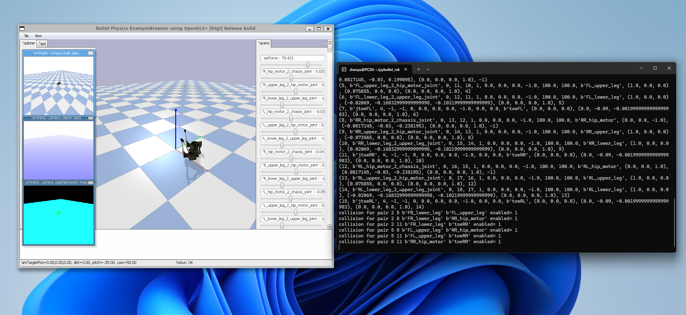
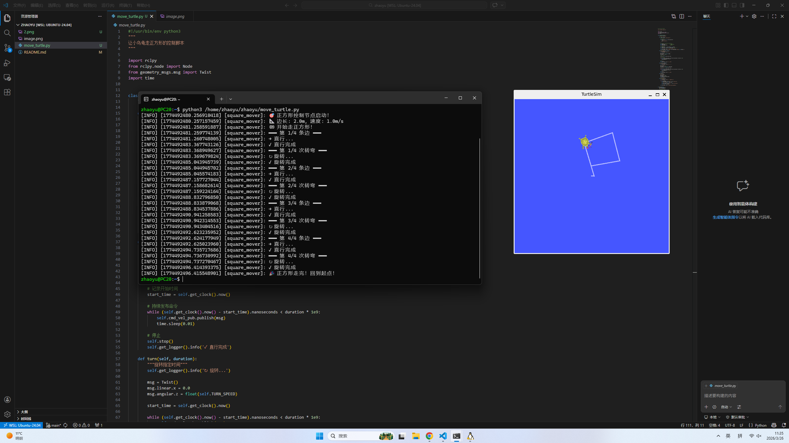

这份总结针对下周的规划方向非常明确，既兼顾了软件编程基本功（Python），又对接了硬件与系统架构（机器人基础/ROS），形成了一个非常闭环的“软硬兼备”学习方案。

为了让这份下周计划的字数达到 600字以上，并展现出更强的学术性、系统性和前瞻性，我为你对每个部分进行了深度的技术扩充：

编程基础：补充了控制流、内存机制（变量本质）以及调试技巧（如断点调试、异常处理）。

机器人基础：补充了传感器数据融合、执行器（电机控制）的闭环反馈控制、以及 ROS 核心概念（如节点、计算图）。

实践与工程目标：引入了模块化编程思想、Linux 下的脚本自动化执行、以及从“面向过程”向“面向工程化”思维的转变。

以下是为你深度扩充和润色后的版本，你可以直接应用到你的周报或学习计划中：

下周学习规划：Python 编程范式、机器人软硬件协同与工程实践
为了巩固前期搭建的 Linux 开发环境，并在实际项目中释放 ROS 的通信效能，下周的学习规划将采取“软件算法基础”与“机器人系统架构”双线并进的策略。通过理论深造与代码实践的结合，进一步提升跨平台工程开发能力。具体规划内容如下：

一、 Python 编程基础概念与程序逻辑控制
下周将系统性地切入 Python 编程语言的核心基础。在语法层面，不仅要掌握变量的定义与声明，更要深入理解其底层的内存动态分配机制；熟练划分整型（int）、浮点型（float）、字符串（string）及列表（list）等核心数据类型，并掌握各类型之间的隐式与显式转换。
在程序控制流方面，将重点攻克以下两个核心板块：

分支逻辑与条件语句：深入学习 if-elif-else 结构，掌握逻辑运算符（AND、OR、NOT）与关系运算符的复合使用，实现程序根据传感器数据或外部输入进行智能决策。

循环结构与迭代控制：熟练运用 for 循环与 while 循环结构，理解循环嵌套、步长控制以及 break 与 continue 语句对执行流程的精准干预，用以处理批量数据或维持机器人状态机的持续轮询。

此外，还将引入函数（Function）的概念，学习形参、实参及返回值的传递机制，建立代码封装与模块化复用的现代编程思维。同时，针对初学者多发的语法错误（SyntaxError）与运行时错误（RuntimeError），将重点学习基于 Python 解释器日志的错误追踪技术（Traceback），掌握基础的 try-except 异常处理方法以及利用 VS Code 进行单步调试与断点观测的技巧，全面拔高独立排错的工程素养。

二、 机器人系统组成、工作原理与 ROS 架构泛化
在机器人工程理论方面，下周将正式解构现代机器人的多维感知与运动控制流。学习将围绕机器人的四大核心物理反馈环展开：

感知识别（传感器）：了解内自感传感器（如 IMU 惯导、编码器）与外自感传感器（如激光雷达 LiDAR、深度相机）的数据获取原理。

执行驱动（执行器）：研究步进电机、伺服电机及液压气动等执行元件的工作机制，理解脉宽调制（PWM）与闭环控制（如 PID 算法）在精确位置与速度控制中的应用。

核心大脑（控制系统）：探讨微控制器（MCU）与嵌入式工业计算机（CPU/GPU）在异构计算中的分工，理解“感知-决策-执行”的数据闭环处理流。

数据链路（通信模块）：认识工业总线（如 CAN 总线）及网络协议（如 TCP/IP）在底层硬件之间的数据交互规范。

在此基础上，将理论延伸至机器人操作系统（ROS）的宏观全局架构。进一步理解 ROS 如何作为“机器人中间件”，通过硬件抽象层（HAL）将复杂的物理底层封装为统一的软件接口，并探讨 ROS 的计算图（Computation Graph）概念如何应用于分布式多节点协同调度，为后续编写原生 ROS 节点打下扎实的理论地基。

三、 Ubuntu 环境下的程序运行、工程实践与作业落实
理论的最终宿命是转化为代码。下周的所有编程练习与课后作业，都将严格限定在已配置完成的 WSL Ubuntu 24.04 开发环境中进行。
我将全面停用 Windows 的图形化运行方式，坚持通过终端（Terminal）执行 Shell 脚本。利用 VS Code 作为核心代码编辑器，编写具有良好代码规范（PEP 8）的 Python 程序。实践作业将围绕“基于条件循环的传感器数据模拟清洗”、“基于函数封装的机器人运动轨迹数学计算”等贴合专业背景的题目展开。通过命令行 python3 main.py 的频繁交互，熟练掌握 Linux 下的文件相对路径读写、环境变量调用以及标准输入输出重定向。通过高强度的工程手感训练，使编写代码、配置环境、终端编译、日志排查这一系列标准化开发流程内化为下意识的肌肉记忆。

四、 综合能力提升与长效发展目标
下周学习的终极导向，是实现从“被动接受代码语意”向“主动构建算法逻辑”的思维跃升。

在认知层面：打破软件与硬件的学科壁垒，清晰梳理出当机器人在外部环境运动时，数据是如何从物理世界经过传感器采集、变成代码中的变量、通过条件语句决策、最后转化为电流驱动电机执行的完整闭环。

在能力层面：全面提升基于 Linux 命令行环境的自主学习能力、英文技术文档（Doc）查阅能力以及对未知 Bug 的独立检索与求解能力。

通过下周对 Python 编程硬实力的打牢与机器人软硬件协同机制的参透，我将为后续深入学习 ROS 2 节点高级编程、多传感器数据融合（TF 坐标变换）、以及 Gazebo 物理仿真环境的搭建构建起最坚固、最不可动摇的底层阶梯。


```#!/usr/bin/env python3
"""
让小乌龟走正方形的控制脚本
"""

import rclpy
from rclpy.node import Node
from geometry_msgs.msg import Twist
import time


class SquareMover(Node):
    """走正方形的控制节点"""

    def __init__(self):
        super().__init__('square_mover')

        # 创建发布者
        self.cmd_vel_pub = self.create_publisher(
            Twist, 
            '/turtle1/cmd_vel', 
            10
        )

        # ============ 参数设置 ============
        self.SPEED = 1.0              # 线速度 m/s
        self.TURN_SPEED = 1.0          # 角速度 rad/s
        self.SIDE_LENGTH = 2.0         # 边长 m

        # 计算运动时间
        self.MOVE_TIME = self.SIDE_LENGTH / self.SPEED
        self.TURN_TIME = 1.5708 / self.TURN_SPEED  # 90° = π/2

        self.get_logger().info('🎯 正方形控制节点启动！')
        self.get_logger().info(f'📐 边长: {self.SIDE_LENGTH}m, 速度: {self.SPEED}m/s')

    def move_straight(self, duration):
        """直行指定时间"""
        self.get_logger().info('→ 直行...')

        msg = Twist()
        msg.linear.x = float(self.SPEED)
        msg.angular.z = 0.0

        # 记录开始时间
        start_time = self.get_clock().now()

        # 持续发布命令
        while (self.get_clock().now() - start_time).nanoseconds < duration * 1e9:
            self.cmd_vel_pub.publish(msg)
            time.sleep(0.01)

        # 停止
        self.stop()
        self.get_logger().info('✓ 直行完成')

    def turn(self, duration):
        """旋转指定时间"""
        self.get_logger().info('↻ 旋转...')

        msg = Twist()
        msg.linear.x = 0.0
        msg.angular.z = float(self.TURN_SPEED)

        start_time = self.get_clock().now()

        while (self.get_clock().now() - start_time).nanoseconds < duration * 1e9:
            self.cmd_vel_pub.publish(msg)
            time.sleep(0.01)

        self.stop()
        self.get_logger().info('✓ 旋转完成')

    def stop(self):
        """停止运动"""
        msg = Twist()
        msg.linear.x = 0.0
        msg.angular.z = 0.0
        self.cmd_vel_pub.publish(msg)
        time.sleep(0.1)

    def move_square(self):
        """执行走正方形"""
        self.get_logger().info('🏁 开始走正方形！')

        for i in range(4):
            self.get_logger().info(f'━━━ 第 {i+1}/4 条边 ━━━')
            self.move_straight(self.MOVE_TIME)

            self.get_logger().info(f'━━━ 第 {i+1}/4 次转弯 ━━━')
            self.turn(self.TURN_TIME)

        self.get_logger().info('🎉 正方形走完！回到起点！')


def main(args=None):
    rclpy.init(args=args)
    node = SquareMover()

    # 给系统一点准备时间
    time.sleep(1)

    # 执行走正方形
    node.move_square()

    node.destroy_node()
    rclpy.shutdown()


if __name__ == '__main__':
    main()