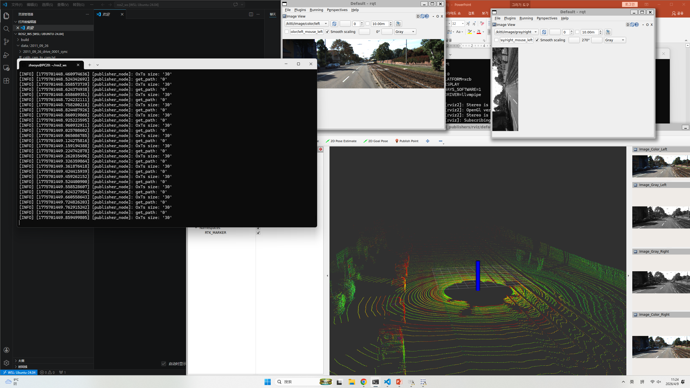

本周学习总结

本周的学习内容主要围绕知识复习、传感器基础理论以及 ROS2 实验展开，并结合课后作业进行实践巩固，具体如下：

一、课程内容复习

本周首先对前期所学内容进行了系统性回顾，包括 Linux 基本操作、编程基础知识以及机器人运动学相关概念。通过对关键知识点的整理与复习，加深了对系统环境配置、程序执行流程以及机器人基础理论的理解，进一步巩固了前期学习成果，为后续实验与进阶学习奠定了基础。

二、传感器基础知识学习

本周学习了机器人常见传感器的基本类型及其工作原理，包括距离传感器、视觉传感器以及惯性测量单元（IMU）等。通过学习，了解了不同传感器在机器人系统中的功能与作用，以及其如何用于环境信息获取与状态感知。同时，对传感器数据的基本特性有了初步认识，例如噪声影响、采样精度以及数据更新频率等，为后续数据处理与控制算法学习打下基础。

三、ROS2 传感器实验

在 Robot Operating System 2（ROS2）环境下完成了传感器相关实验操作。通过运行节点程序，并使用命令行工具（如 ros2 topic list、ros2 topic echo 等）对话题数据进行查看与分析，观察传感器数据的发布与订阅过程，从而理解 ROS2 中基于话题（Topic）的通信机制。通过实际操作，加深了对机器人系统中信息交互流程的理解。

四、课后作业完成情况

根据课程要求完成了相关课后作业，包括基础程序编写与实验结果分析。在 Ubuntu 开发环境中进行了代码的编写、运行与调试，进一步熟悉了完整的软件开发流程。同时，对实验过程中出现的问题进行了记录与分析，提高了问题排查与解决能力。

五、本周总结

总体而言，本周通过“理论复习 + 知识学习 + ROS2 实验 + 作业实践”的方式，进一步巩固了机器人系统相关基础知识，并提升了在 ROS2 环境下进行实际开发与调试的能力，为后续深入学习机器人控制与系统开发奠定了良好基础。

