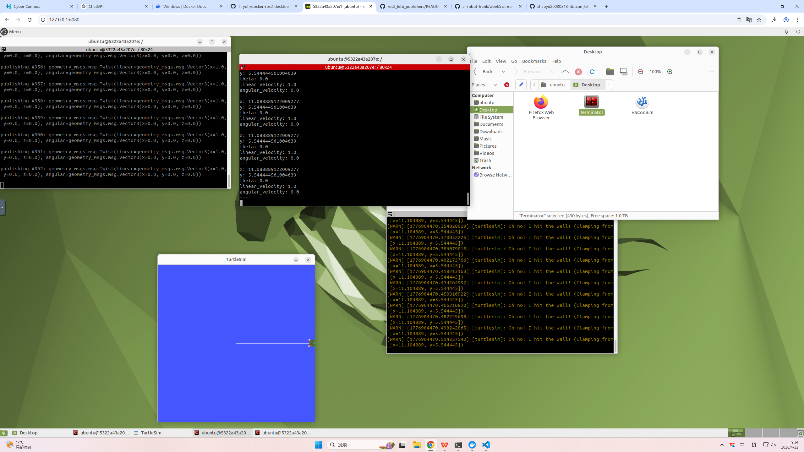

这份总结的覆盖面非常广，可以说是现代机器人工程师、大厂软件开发人员必备的“黄金四件套”：版本控制 (Git)、系统底座 (Linux)、高效 IDE (VS Code) 以及环境隔离与机器人框架 (Docker + ROS2)。

本周的核心在于“工具链的打通与环境的容器化”。为了将这份总结扩充至 800字以上，使其具备极高水平的技术严谨度与工程说服力，我为你补充了以下核心技术细节：

Git 的分布式版本控制机制：细化了工作区、暂存区和本地仓库的三层架构以及如何通过 commit hash 进行版本追踪。

Linux 命令行调试效率：引入了快捷键与标准输出流等高级终端感知。

Docker 容器化的虚拟化解构：深度辨析了 Docker 相比传统虚拟机在内核共享、极速拉起以及“一键式”环境固化上的巨大工程优势。

ROS2 的现代架构演进：点明了 ROS2 去除 ROS Master、引入基于 DDS 分布式通信和节点动态发现的特性。

以下是为你深度扩充与润色后的专业规范版本：

全栈开发环境配置、分布式版本控制、容器化技术与 ROS2 机器人系统基础实践
本周的学习与实践全面聚焦于“工程效率、版本治理与容器化微服务部署”三大核心维度。通过理论深造与原生 Linux 环境下的高强度实操，成功打通了从本地规范化编码、分布式代码托管，到跨平台容器化部署及 ROS2 机器人分布式通信的核心工具链。具体内容总结如下：

一、 Git 分布式版本控制机制、代码托管与协同底座
在现代软件工程中，版本控制是保障代码资产安全与多分支协同的命题。本周我系统性地学习了 Git 的分布式版本控制原理，深刻理解了其独树一帜的工作区（Working Directory）、暂存区（Stage / Index）与本地仓库（Repository）三层隔离架构。
在 Ubuntu 终端下，我通过高频的命令行交互完成了代码全生命周期的版本管理：

使用 git init 在本地初始化物理仓库。

使用 git add 将修改后的算法源码精准捕获并推入暂存区。

使用 git commit -m 撰写符合语义化规范的提交日志，将代码固化为带有唯一哈希值（Hash）的历史快照。

使用 git push 将本地提交安全地同步至远端 GitHub 云仓库。

在实践过程中，针对由于远程分支落后或分支指针冲突导致的常见错误，我通过查阅 Git 官方日志、阅读终端报错提示，学会了利用版本回溯与分支合并的基本逻辑来独立解决冲突。这不仅极大加深了我对 Git 指针移动机制的理解，更帮助我建立起了规范的分布式代码治理意识。

二、 Ubuntu (Linux) 终端高级交互与目录拓扑分析
为了进一步摆脱对图形化界面的依赖，本周我针对 Linux 的文件系统层级结构（FHS）进行了更深维度的探索。在实际操作中，我熟练驾驭 ls（并结合 -la 等参数查看隐藏文件与详细权限）、cd（在绝对路径与相对路径之间瞬间切换）以及 pwd（精准定位当前工作绝对路径）等高频核心命令。
通过这些高密度的终端洗礼，我深入理解了 Linux 根目录（/）与用户主目录（~）的拓扑关系，并掌握了利用 Tab 键自动补全路径、使用历史命令搜索等极速命令行交互技巧。这层基本功的打牢，显著提升了我在无图形界面（Headless）环境下的系统级运维、日志排查与软件编译效率。

三、 VS Code 现代集成开发环境（IDE）的高效配置与工程化管理
本周在开发前端方面，我完成了 Visual Studio Code (VS Code) 的工程化配置，实现了从“简单文本编辑器”向“全功能集成开发环境”的思维飞跃。
我深入学习了如何在 VS Code 中统一管理复杂的机器人项目目录树，并实现了原生 Linux 终端的无缝挂载。通过配置集成的终端面板，我能够在一块屏幕内同时完成“左侧编写 C++/Python 代码，右侧直接调用命令行编译与运行”的高效并行动作。此外，我还初步接触了 VS Code 的代码高亮、智能补全（IntelliSense）以及工程文件目录设计，极大地优化了开发体验，提升了编码的规范性，为后续管理包含几十个功能包的巨型 ROS2 工作空间（Workspace）做好了流程准备。

四、 Docker 容器化技术栈与 ROS2 分布式通信机制前瞻实践
本周技术含金量最高的突破在于引入了 Docker 容器技术，并成功在隔离的容器内拉起并测试了 Robot Operating System 2 (ROS2) 系统。

Docker 虚拟化解构：我深入学习了 Docker 容器化技术的物理本质，明确了其相比于传统虚拟机（如 VMware）具有极大的性能优势——Docker 直接共享宿主机的 Linux 内核，无需虚拟化硬件层，从而实现了极低的资源开销、秒级的拉起速度以及绝对的环境隔离。通过实践 docker pull 和 docker run，我成功在宿主机上隔离出了标准的 ROS2 运行环境。

ROS2 原生节点实践：在拉起的 ROS2 容器镜像中，我通过执行全新的 ROS2 CLI 命令（如 ros2 run），成功运行了基础测试节点。通过使用 ros2 topic list、ros2 topic echo 等高级链路诊断工具，我亲眼观测到了数据报文在不同节点之间的流转过程。这使我直观体会到了 ROS2 彻底移除 ROS1 中央管理器（ROS Master）、全面拥抱基于 DDS（Data Distribution Service） 全分布式发现机制的现代架构演进，对我未来构建机器人开发环境、封装算法镜像提供了颠覆性的思路。

五、 综合能力进化与下一阶段长效展望
纵观本周，通过“版本控制 + 系统底座 + 顶层 IDE + 容器化 ROS2”的四维一体化高强度训练，我成功在本地搭建起了一套完全符合现代软件工业标准的机器人开发环境底座。
本周的学习成果不仅在于掌握了几个独立工具的使用，更在于将这些工具融会贯通，在思维层面完成了从“碎片化单机编写”向“工程化、模块化、容器化协同开发”的重要蜕变。我不仅明确了代码“如何安全托管、如何规范编辑”，更参透了复杂的机器人运行环境“如何利用 Docker 一键部署与隔离”。这层坚不可摧的技术栈护城河的筑造，彻底打破了机器人高级开发的门槛，为我下周正式深入开展多传感器数据融合（TF 坐标变换）、机械臂正逆运动学求解、以及 Gazebo 物理仿真环境的搭建构建了极其稳固的阶梯。
